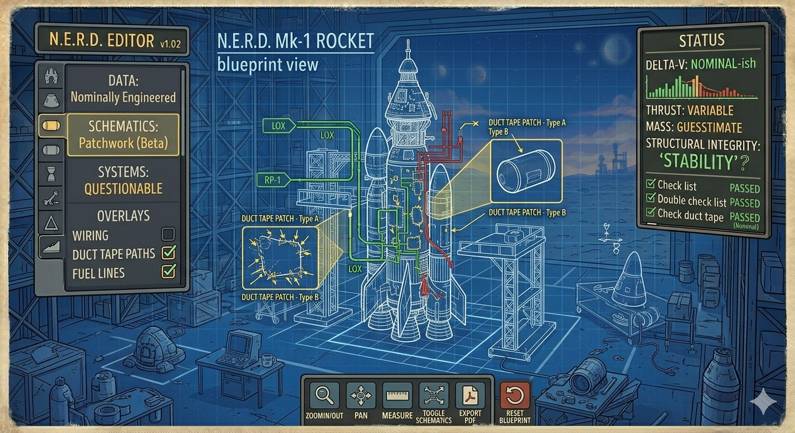

# 17. Metrics and Live Readouts

## Scope
- Live totals and markers: mass, CoM, CoT, thrust vector, torque tendency.
- Stability/misalignment feedback and qualitative indicators.

## Related
- Part Data Model — `vab/spec/12-part-data-model.md`
- Editor Interaction — `vab/spec/07-editor-interaction-model.md`
- Acceptance — `vab/spec/20-acceptance-criteria.md`

MIGRATION NOTE: Content preserved in `vab/spec/00-full-compiled.md`. This file will be expanded to include full text.

## Concept Art
Blueprint-style overlay view showing lines and markers (for inspiration only — final v1 overlays are simplified CoM/CoT/thrust vector):

