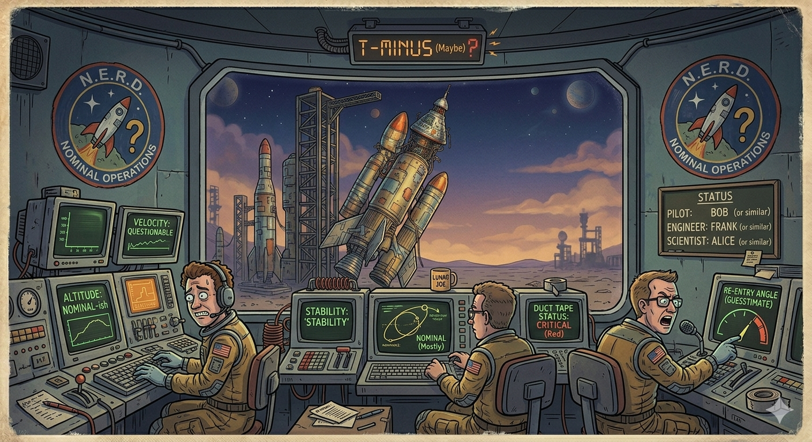

# 18. Technical Architecture Considerations

## Scope
- UE5 target, subsystem split, separation of concerns, deterministic rebuilds.
- Contract-first design between editor and flight module.

## Related
- Part Data Model — `vab/spec/12-part-data-model.md`
- Craft File — `vab/spec/13-craft-file.md`
- Parametric System — `vab/spec/06-parametric-part-system.md`
- Acceptance — `vab/spec/20-acceptance-criteria.md`

MIGRATION NOTE: Content preserved in `vab/spec/00-full-compiled.md`. This file will be expanded to include full text.

## Concept Art
Operations/control-room vibe that can inform the separate flight module UI (out of scope for VAB v1 but relevant to contract-first split):

